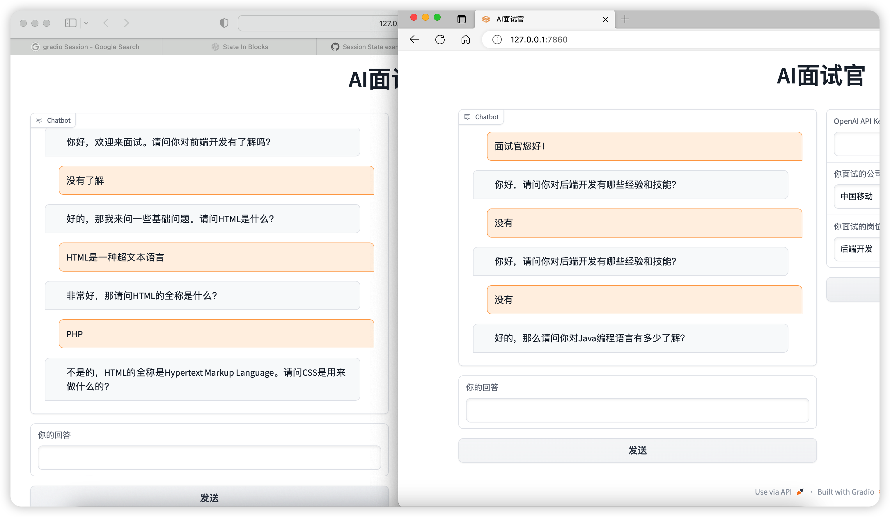
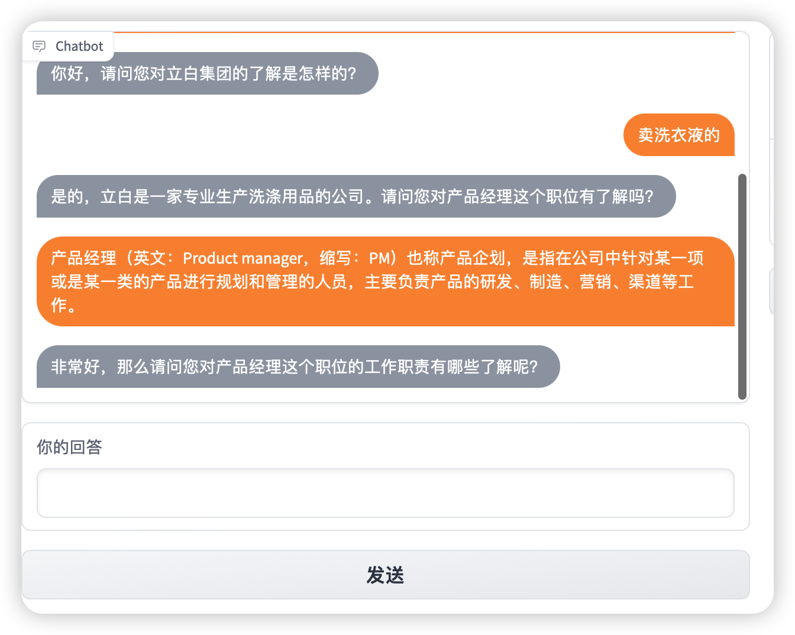

## ChatGPT AI 面试官
一个简单的基于ChatGPT开发的AI辅助面试的小程序

## 效果




## 使用方法
1.安装依赖
```
pip install gradio==3.21.0
pip install openai
```
2.启动程序
```
python app.py
```
3.在右边栏填入你的API_KEY和面试公司（需要加上领域）和面试的岗位，点击开始面试

4.开始面试后在左边栏里面回答问题
